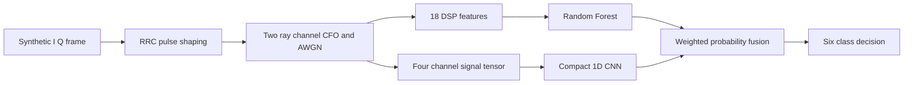
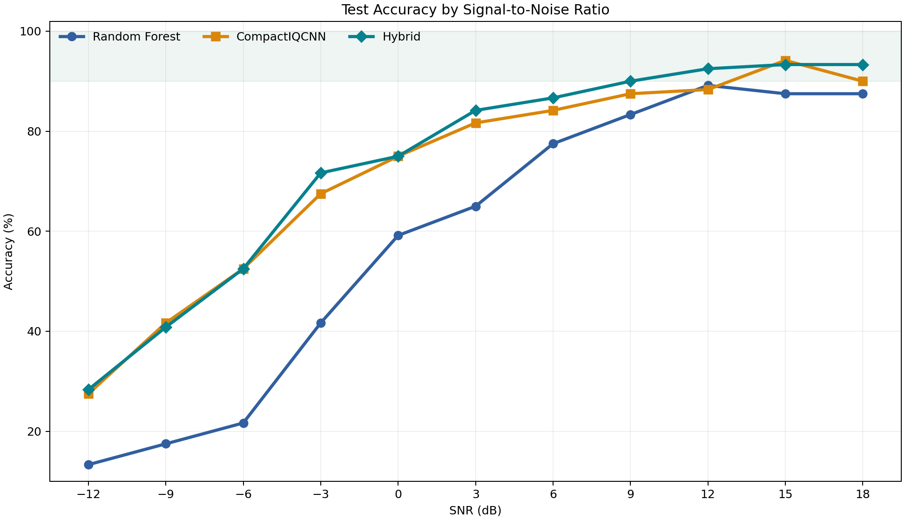
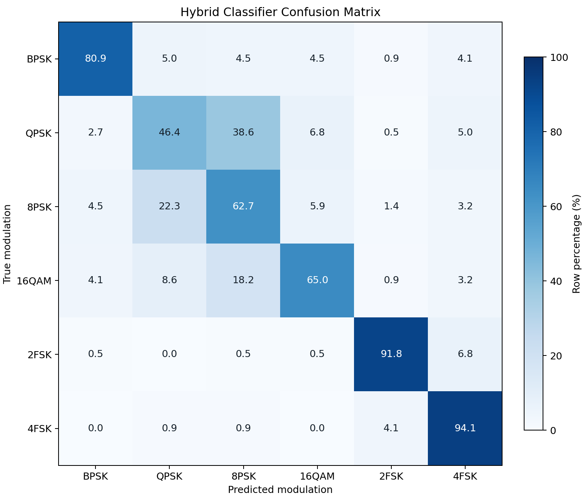
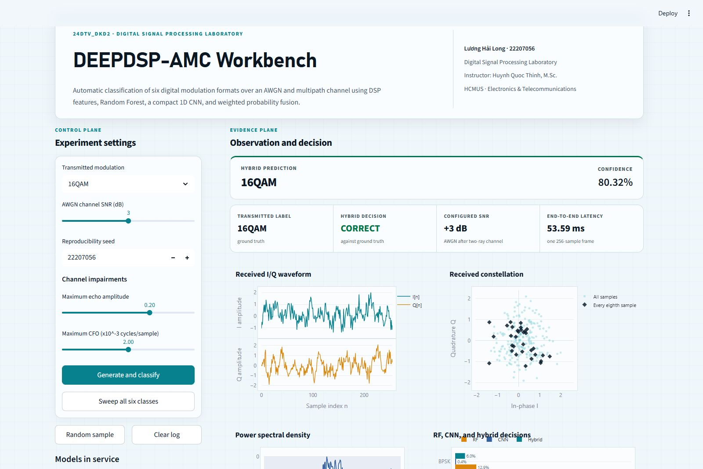

<div align="center">


# DEEPDSP-AMC

Automatic modulation classification using digital signal processing, machine learning, and deep learning

[](https://github.com/lhlizdabezt/DEEPDSP-Automatic-Modulation-Classification/actions/workflows/validate.yml)
[](https://github.com/lhlizdabezt/DEEPDSP-Automatic-Modulation-Classification/releases)


[Report](reports/24DTV_DKD2_22207056_LuongHaiLong_BanMoTa_DoAn_AMC.pdf) | [Executed notebook](notebooks/24DTV_DKD2_22207056_LuongHaiLong_SourceCode_AMC.ipynb) | [Demo video](https://youtu.be/yl5Sk6plWXg) | [Latest release](https://github.com/lhlizdabezt/DEEPDSP-Automatic-Modulation-Classification/releases/latest)

</div>

DEEPDSP-AMC classifies six digital modulation formats from short complex baseband frames. It compares an interpretable Random Forest trained on 18 DSP features with a compact 1D convolutional neural network, then combines their posterior probabilities using a validation-selected weight.

> [!IMPORTANT]
> The dataset is synthetic and controlled. The reported results do not claim validation on SDR captures, live radio hardware, or field channels.

## Project record

| Field | Verified value |
|---|---|
| Student | Luong Hai Long, 22207056 |
| Program | Electronics and Telecommunications |
| Institution | VNUHCM-University of Science |
| Course | Digital Signal Processing Laboratory |
| Class | 24DTV_DKD2 |
| Instructor | Huynh Quoc Thinh, M.Sc. |
| Reproducibility seed | `22207056` |
| Signal classes | BPSK, QPSK, 8PSK, 16QAM, 2FSK, 4FSK |

## System design



Each frame contains 256 complex samples at eight samples per symbol. The simulation spans SNR values from -12 dB to 18 dB in 3 dB increments and generates 6,600 balanced frames. SNR is used for generation and stratification, not as a classifier input.

## Measured results

All values below come from the fixed 1,320-frame test split. The fusion coefficient was selected on validation data and locked before test evaluation.

| Method | Accuracy | Macro F1 | Model detail |
|---|---:|---:|---|
| Random Forest | 58.48% | 58.17% | 400 trees, 18 DSP features |
| CompactIQCNN | 71.82% | 72.01% | 81,030 trainable parameters |
| Hybrid | **73.48%** | **73.40%** | CNN weight `0.55` |

The hybrid reaches 90.00% accuracy at 9 dB and 93.33% at 15 dB and 18 dB. At -12 dB, accuracy falls to 28.33%, which makes the low-SNR limitation explicit.

<table>
  <tr>
    <td width="50%"></td>
    <td width="50%"></td>
  </tr>
  <tr>
    <td align="center"><sub>Test accuracy across the documented SNR grid.</sub></td>
    <td align="center"><sub>Row-normalized hybrid confusion matrix on the fixed test split.</sub></td>
  </tr>
</table>

## Interactive workbench



The app generates a fresh frame from the displayed seed, applies the documented channel, extracts the DSP representation, runs both trained models, fuses the probabilities, and updates the plots and execution log. It does not display stored predictions.

### Windows quick start

1. Install 64-bit Python 3.14.
2. Open `demo_app`.
3. Double-click `RUN_DEMO_APP.cmd`.
4. Wait for the isolated environment to install on the first run.
5. Open `http://localhost:8501` if the browser does not open automatically.

Manual PowerShell equivalent:

```powershell
cd demo_app
py -3.14 -m venv .venv
.\.venv\Scripts\python.exe -m pip install --requirement requirements.txt
.\.venv\Scripts\python.exe -m streamlit run app.py
```

## Reproduce the notebook

```powershell
py -3.14 -m venv .venv
.\.venv\Scripts\python.exe -m pip install --requirement requirements.txt
.\.venv\Scripts\python.exe -m ipykernel install --user --name deepdsp-amc
.\.venv\Scripts\python.exe -m jupyter nbconvert --execute --to notebook --inplace --ExecutePreprocessor.kernel_name=deepdsp-amc notebooks\24DTV_DKD2_22207056_LuongHaiLong_SourceCode_AMC.ipynb
```

Training is CPU-compatible. The released run used Python 3.14.3 and PyTorch 2.11 CPU. Exact package versions are pinned in [requirements.txt](requirements.txt).

## Repository map

| Path | Purpose |
|---|---|
| `notebooks/` | Executed research notebook with embedded outputs |
| `src/` | Linear Python export of the notebook workflow |
| `demo_app/` | English Streamlit interface, inference engine, and compressed models |
| `results/` | Metrics, training history, and test predictions |
| `assets/figures/` | Original report figures retained for auditability |
| `assets/readme/` | English figures and interface capture used here |
| `report/` | Typst source for the submitted academic report |
| `reports/` | Final 44-page A4 report PDF |
| `qa/` | Deterministic repository and release checks |
| `docs/` | Video metadata, demonstration script, and supporting guidance |

Course-submission artifacts retain their original language and formatting to preserve provenance. Public documentation, the app interface, repository metadata, and release notes use US English.

## Validation

Run the repository gate before citing or releasing results:

```powershell
py -3.14 -m pip install pypdf pillow
py -3.14 qa\validate_repository.py
```

The gate checks notebook execution state, embedded outputs, fixed metrics, report pagination and text extraction, figure integrity, model packaging, source markers for live inference, banner safety, file-size limits, and repository hygiene. The original submission additionally passed a 44-page visual/report audit and the Moodle 20 MB package limits.

## Limitations and next work

- Controlled simulation cannot reproduce every oscillator, converter, antenna, interference, clipping, DC-offset, and time-varying channel effect.
- QPSK and 8PSK remain difficult at low SNR under phase and frequency disturbance.
- Per-SNR values use finite test strata and should not be treated as confidence-bounded field estimates.
- The next meaningful experiment is a locked-protocol evaluation on labeled RTL-SDR or USRP captures, followed by calibration and domain-shift analysis.

## Frequently asked questions

<details>
<summary><strong>Does the model use SNR as an input feature?</strong></summary>

No. SNR controls signal generation and dataset stratification. The classifiers receive only signal-derived DSP features or the four-channel frame tensor.
</details>

<details>
<summary><strong>Why combine Random Forest and CNN outputs?</strong></summary>

The branches encode different evidence. Random Forest uses explicit amplitude, phase, moment, crossing, and spectral statistics; the CNN learns local structure from I, Q, magnitude, and phase-difference channels. Validation selected a CNN weight of 0.55.
</details>

<details>
<summary><strong>Are the app results precomputed?</strong></summary>

No. `infer_frame` generates the signal, computes all representations, calls `predict_proba`, runs the CNN under `torch.inference_mode`, and fuses the probabilities for each request.
</details>

<details>
<summary><strong>Can these numbers be quoted as real-radio performance?</strong></summary>

No. Cite them only as results for the documented synthetic experiment. Real-radio performance requires a separate SDR dataset and evaluation protocol.
</details>

## Author

Luong Hai Long studies Electronics and Telecommunications at VNUHCM-University of Science, with project interests in signal processing, machine learning, computer vision, embedded systems, and wireless communications.

[LinkedIn](https://www.linkedin.com/in/lhlizdabezt) | [YouTube](https://www.youtube.com/@lhlizdabezt) | [Facebook](https://www.facebook.com/wageseadrake) | [Instagram](https://www.instagram.com/lhlizdabezt) | [TikTok](https://www.tiktok.com/@wageseadrake) | [Email](mailto:luonghailong.work@gmail.com)

For academic correspondence: [22207056@student.hcmus.edu.vn](mailto:22207056@student.hcmus.edu.vn). Phone and Zalo: [+84 988 114 708](tel:+84988114708).

## Citation

Use the metadata in [CITATION.cff](CITATION.cff) and identify the repository version or release tag. See [NOTICE.md](NOTICE.md) for the academic-scope boundary.

